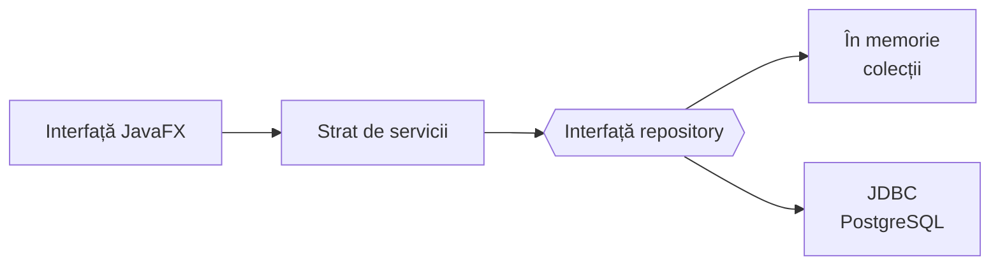
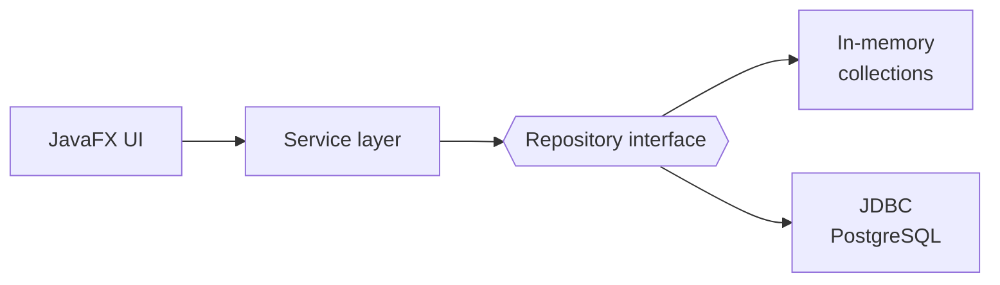

<h1 align="center">INVOX</h1>

<p align="center">
  <i>O aplicație desktop de facturare și gestiune a stocului, construită în Java + JavaFX.</i><br>
  Te autentifici ca firmă, administrezi produse și clienți și emiți facturi care țin stocul sincronizat — cu stocare în memorie sau în PostgreSQL.
</p>

<p align="center">
  
  
  
  
  
</p>

---

## Prezentare

**INVOX** este o aplicație de facturare și gestiune a stocului. Un cont de firmă administrează
produse, clienți (persoane juridice *sau* fizice) și facturi. Emiterea unei facturi scade automat stocul într-un mod sigur și consistent; 
anularea ei îl reface. Aplicația rulează complet **în memorie** pentru demo-uri rapide sau poate salva datele 
într-o bază de date **PostgreSQL** prin intermediul JDBC — aceeași logică de business, fără modificări de cod. Fiecare
acțiune este scrisă într-un jurnal de audit.

## Funcționalități

| Zonă         | Capabilități                                                                          |
|--------------|---------------------------------------------------------------------------------------|
| **Auth**     | Înregistrare / autentificare ca cont de firmă (parole stocate ca hash)                |
| **Produse**  | Adăugare, editare, ștergere · categorii dinamice                                      |
| **Clienți**  | Persoane juridice și fizice · adăugare, vizualizare, editare, ștergere                |
| **Facturi**  | Emitere cu mai multe linii · vizualizare în format real (furnizor / client / linii / totaluri) · marcare ca plătită · anulare (reface stocul) · ștergere |
| **Stoc**     | Ajustare automată la emitere / anulare                                                |
| **Cont**     | Editarea datelor firmei · schimbarea parolei                                          |
| **Audit**    | Jurnal `audit.csv` (`nume_actiune, timestamp`)                                        |

## Tehnologii

| Strat        | Tehnologie              |
|--------------|-------------------------|
| Limbaj       | Java 17+                |
| Interfață    | JavaFX                  |
| Persistență  | PostgreSQL + JDBC       |
| Build        | Maven                   |

## Arhitectură



Serviciile comunică doar cu **interfețele** de repository. Un singur comutator `USE_DATABASE` din
`InvoxApp` alege backend-ul, astfel încât aceeași logică rulează pe date volatile în memorie sau pe
o bază de date reală.

## Design patterns

| Pattern    | Unde                                                       | De ce                                            |
|------------|------------------------------------------------------------|--------------------------------------------------|
| Singleton  | `AuditService`, `database.Database`, `database.GenericDao` | O singură sursă de conexiune / jurnal de audit   |
| Factory    | `patterns.ClientFactory`                                   | Creează subtipul corect de `Client` (firmă / persoană fizică) |
| Builder    | `patterns.InvoiceBuilder`                                  | Asamblează o factură cu mai multe linii și calculează totalurile |

## Pornire rapidă

**Cerințe:** JDK 17+ și Maven.

```bash
mvn clean compile javafx:run
```

Implicit rulează în memorie — nu necesită bază de date. Cont demo: **`demo` / `demo`**.

<details>
<summary><b>Rulare cu PostgreSQL</b></summary>

```bash
psql -U postgres -d invox -f src/main/resources/db/schema.sql
psql -U postgres -d invox -f src/main/resources/db/seed.sql   # date de test (optional)
```

Editează `src/main/resources/db.properties`, apoi pune în `ui/InvoxApp.java`:

```java
private static final boolean USE_DATABASE = true;
```

> Comutatorul schimbă **toate** repository-urile pe JDBC deodată — nu amesteca backend-urile.
</details>

## Structura proiectului

```
src/main/java/invox/
├── model/        clase de domeniu (Product, Client, Invoice, User, ...)
├── repository/   acces la date — implementări in-memory și JDBC
├── service/      logica aplicației (CRUD, facturare, audit, auth)
├── exception/    ierarhia de excepții custom
├── database/     conexiune + DAO generic (Singleton)
├── patterns/     ClientFactory (Factory), InvoiceBuilder (Builder)
└── ui/           interfața JavaFX
src/main/resources/
├── db/           schema.sql
├── styles.css    tema vizuală
└── db.properties configurarea conexiunii
```

---------------------------------------------------------------------------------------
*ENG

<h1 align="center">INVOX</h1>

<p align="center">
  <i>A desktop invoicing & inventory platform built in Java + JavaFX.</i><br>
  Log in as a company, manage products and clients and issue invoices that keep stock in sync — backed by either in-memory storage or PostgreSQL.
</p>

<p align="center">
  
  
  
  
  
</p>

---

## Overview

**INVOX** is an invoicing and inventory app. A company account manages products,
clients (companies *or* individuals) and invoices. Issuing an invoice decreases stock atomically;
cancelling one restores it. The application runs fully **in memory** for instant demos, or persists
to **PostgreSQL** via JDBC — the same business logic, no code changes. Every action is written to an
audit log.


## Features

| Area        | Capabilities                                                                         |
|-------------|--------------------------------------------------------------------------------------|
| **Auth**    | Register / log in as a company account (hashed passwords)                            |
| **Products**| Create, edit, delete · dynamic categories                                            |
| **Clients** | Companies & individuals · create, view, edit, delete                                 |
| **Invoices**| Multi-line issuing · realistic invoice view (supplier / client / lines / totals) · mark paid · cancel (restores stock) · delete |
| **Stock**   | Automatic adjustment on issue / cancel                                               |
| **Account** | Edit company details · change password                                               |
| **Audit**   | `audit.csv` log (`action_name, timestamp`)                                           |

## Tech stack

| Layer        | Technology              |
|--------------|-------------------------|
| Language     | Java 17+                |
| UI           | JavaFX                  |
| Persistence  | PostgreSQL + JDBC       |
| Build        | Maven                   |

## Architecture



Services talk only to repository **interfaces**. A single `USE_DATABASE` flag in `InvoxApp` selects
the backend, so identical logic runs on volatile in-memory data or a real database.

## Design patterns

| Pattern    | Where                                                      | Why                                              |
|------------|------------------------------------------------------------|--------------------------------------------------|
| Singleton  | `AuditService`, `database.Database`, `database.GenericDao` | One shared connection source / audit sink        |
| Factory    | `patterns.ClientFactory`                                   | Builds the right `Client` subtype (company / individual) |
| Builder    | `patterns.InvoiceBuilder`                                  | Assembles a multi-line invoice and computes totals |

## Getting started

**Prerequisites:** JDK 17+ and Maven.

```bash
mvn clean compile javafx:run
```

Runs in memory by default — no database required. Demo account: **`demo` / `demo`**.

<details>
<summary><b>Run with PostgreSQL</b></summary>

```bash
psql -U postgres -d invox -f src/main/resources/db/schema.sql
psql -U postgres -d invox -f src/main/resources/db/seed.sql   # optional sample data
```

Edit `src/main/resources/db.properties`, then set in `ui/InvoxApp.java`:

```java
private static final boolean USE_DATABASE = true;
```

> The flag switches **all** repositories to JDBC at once — don't mix backends.
</details>

## Project structure

```
src/main/java/invox/
├── model/        domain classes (Product, Client, Invoice, User, ...)
├── repository/   data access — in-memory & JDBC implementations
├── service/      application logic (CRUD, invoicing, audit, auth)
├── exception/    custom exception hierarchy
├── database/     connection + generic DAO (Singleton)
├── patterns/     ClientFactory (Factory), InvoiceBuilder (Builder)
└── ui/           JavaFX interface
src/main/resources/
├── db/           schema.sql
├── styles.css    visual theme
└── db.properties connection config
```
